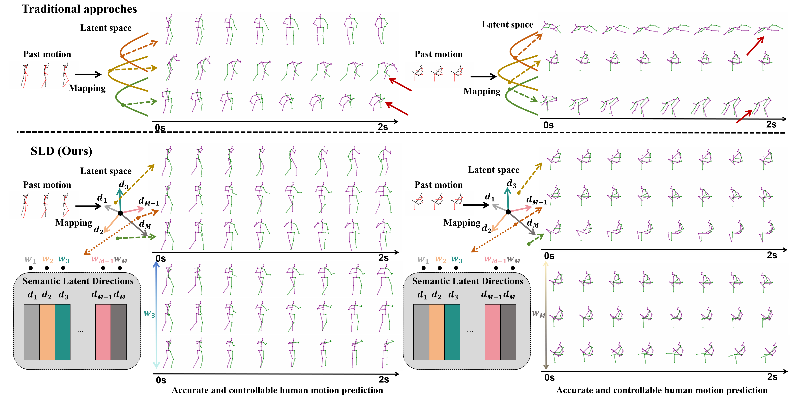

# "Learning Semantic Latent Directions for Accurate and Controllable Human Motion Prediction" (**ECCV 2024**)



---
This repo contains the official implementation of the paper:

Learning Semantic Latent Directions for Accurate and Controllable Human Motion Prediction

Guowei Xu\*, Jiale Tao\*, Wen Li, Lixin Duan

ECCV 2024
[[arxiv](https://arxiv.org/abs/2407.11494)]
### Dependencies
* Python >= 3.8
* [PyTorch](https://pytorch.org) >= 1.9
* Tensorboard
* matplotlib
* tqdm
* argparse

### Get the data
We adapt the data preprocessing from [GSPS](https://github.com/wei-mao-2019/gsps).
* We follow the data preprocessing steps ([DATASETS.md](https://github.com/facebookresearch/VideoPose3D/blob/master/DATASETS.md)) inside the [VideoPose3D](https://github.com/facebookresearch/VideoPose3D) repo.
* Given the processed dataset, we further compute the multi-modal future for each motion sequence. All data needed can be downloaded from [Google Drive](https://drive.google.com/drive/folders/1sb1n9l0Na5EqtapDVShOJJ-v6o-GZrIJ?usp=sharing) and place all the dataset in ``data`` folder inside the root of this repo.

### Get the pretrain models
* All pretrain models can be downloaded from [Google Drive](https://drive.google.com/drive/folders/13pBFuPOH1jC7x6eHLrD2GiZfy00GONbG?usp=sharing) and place all the pretrain models in ``result`` folder inside the root of this repo.

### Train
We have used the following commands for training the network on Human3.6M or HumanEva-I with skeleton representation:
```bash
python train_nf.py --cfg [h36m/humaneva]
python main.py --cfg [h36m/humaneva]
```
 ### Test
 To test on the pretrained model, we have used the following commands:
  ```bash
 python main.py --cfg [h36m/humaneva] --mode test --iter 500
  ```
 ### Visualization
 For visualizing from a pretrained model, we have used the following commands:

   ```bash
 python main.py --cfg [h36m/humaneva] --mode viz --iter 500
  ```

 ### Acknowledgments
 
 This code is based on the implementations of [STARS](https://github.com/Sirui-Xu/STARS).

 ## Citation
If you find this work useful in your research, please cite:

```bibtex
@article{xu2024learning,
  title={Learning Semantic Latent Directions for Accurate and Controllable Human Motion Prediction},
  author={Xu, Guowei and Tao, Jiale and Li, Wen and Duan, Lixin},
  journal={arXiv preprint arXiv:2407.11494},
  year={2024}
}
```

## License

This repo is distributed under an [MIT LICENSE](LICENSE)
